# 微知 WeiZhi

一个自己用的 AI 学习管家。每天挑几篇值得读的做成卡片，隔几天再问我一遍；卡片里的话都能追回原文，质量每天自动检查、自己修。整套跑在一台 2C2G 的机器上，模型成本一天两毛钱左右。

中文 | [English](README.en.md)

    

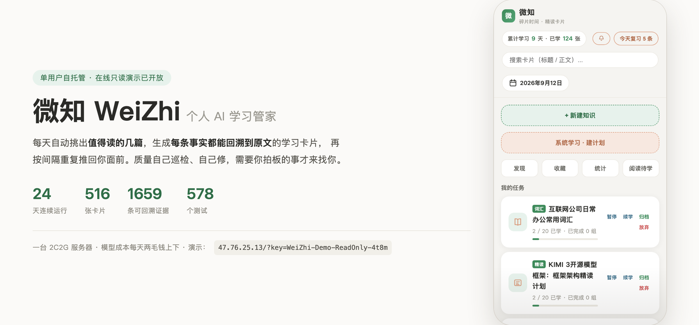

## 在线演示

http://47.76.25.13/?key=WeiZhi-Demo-ReadOnly-4t8m

上面这个口令只能看。真实的卡片、复习、发现层和质量报告都能翻，但新增、编辑、标记已学这些写操作不会生效（服务端返回 403，不是前端把按钮藏了）。页面顶部会有一行说明。

## 它解决的问题

我以前的习惯是看到好文章就收藏，收藏夹越来越长，一篇也没读完。

问题不在于没有内容，而在于没有任何东西替我决定今天读哪一篇，也没有什么东西让读过的留下来。读完就散了。

所以这个项目从一开始只有一个目标：每天打开它，能读到值得读的东西，读完能留下点什么。

后面几乎所有的取舍都是这句话推出来的。比如为什么要先建候选池再挑，而不是抓来什么就读什么；为什么质量修复不能直接改已经发布过的卡；以及为什么某天没有值得读的东西时，它就真的什么都不产出。

## 现在长什么样

下面是一条真实的使用动线。

| 首页 | 发现层 |
|---|---|
| 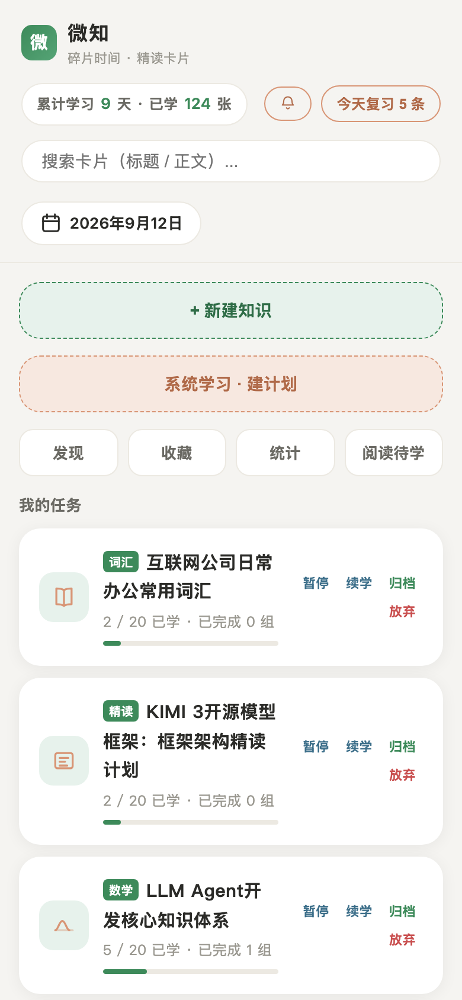 | 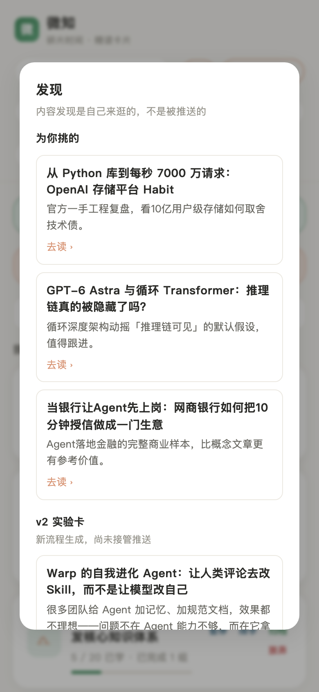 |
| 打开就是今天可以读的卡片，加上正在进行的系统学习计划。 | 不是推送，是自己想逛的时候进来的地方。每条挑出来的都会附一句为什么，没有值得挑的时候这里就是空的。 |

| 精读卡 | 间隔复习 |
|---|---|
| 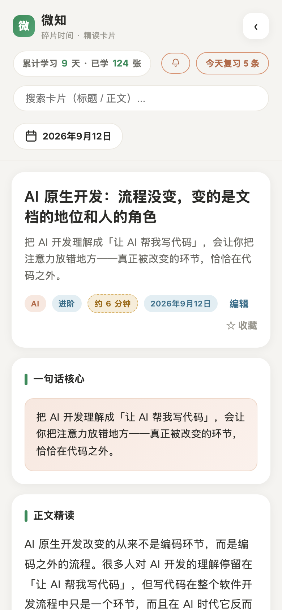 | 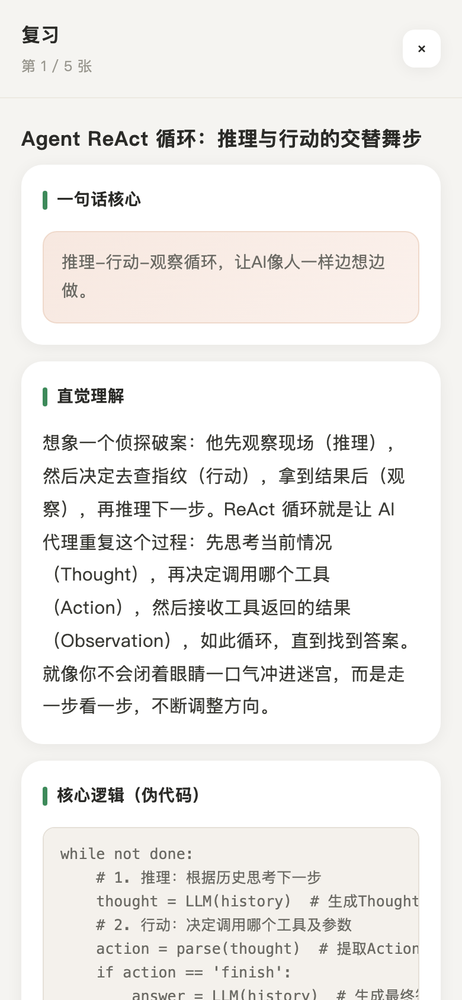 |
| 卡片底部有信源、来源级别和原文链接，正文里的引用编号能对回原文。 | 到期的卡按 SM-2 排进队列。选择题在服务端判分，简答题交给模型批改。 |

| 统计 | 质量巡检 |
|---|---|
| 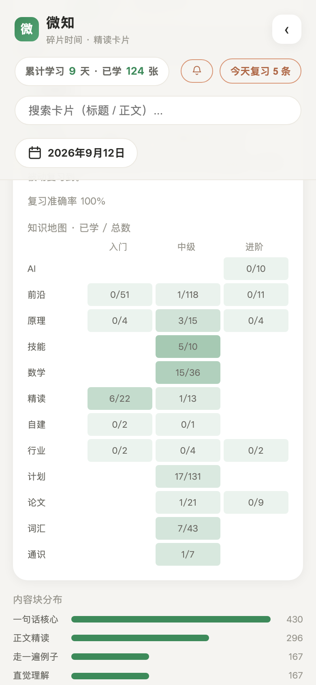 | 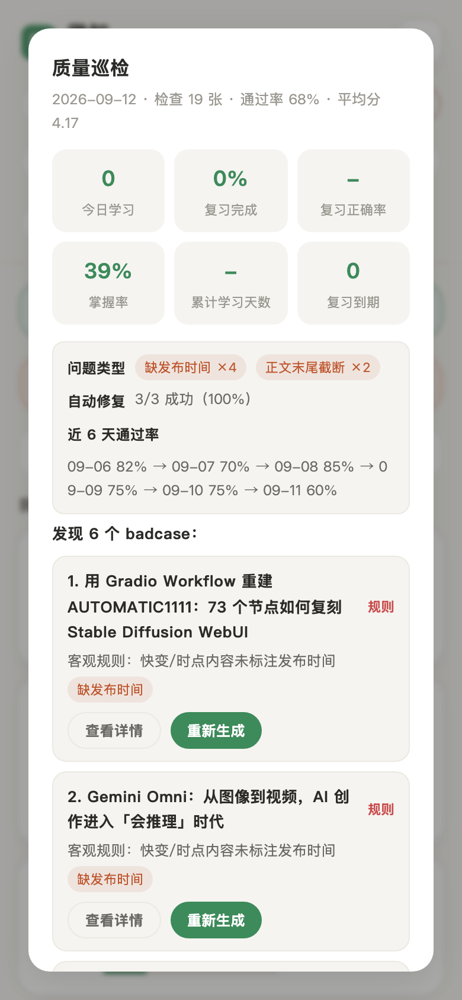 |
| 「有多少张卡从来没进过复习」这种事，不画出来是看不见的。 | 每天 3:30 自动检查和打分，坏卡重新生成，每条修复都能回滚。 |

## 几个判断

四件我自己做的决定，连同当时放弃了什么。挑这四条是因为它们都能核对——截图、数字、数据库里查得到。

### 卡片里的事实得能追回原文

最早的做法是把整篇正文丢给模型让它写卡。读起来很顺，但没法核对：它会添一些自己记得的背景，也会把「某位高管说」写成「公司宣布」。

后来拆成两步。先从原文里确定性地抽出事实，带上位置；写作时只把这些事实喂给它，正文里每段标上引用编号。抽不出足够事实的材料，直接不产卡。

代价是慢一点，也浪费掉一些材料，模型不能再自己补充背景。换来的是卡片底部有信源、来源级别和原文链接，数据库里存着 1659 条抽出来的事实，正文里的编号能对回去。

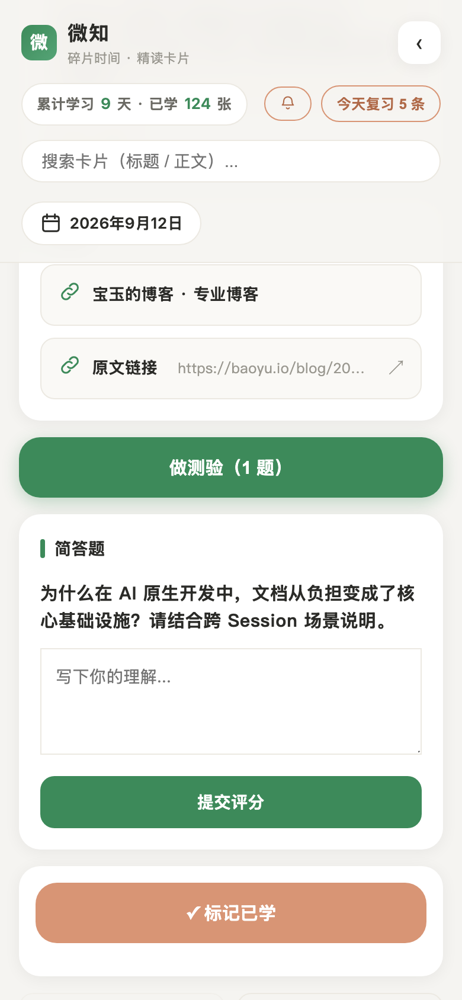

### 质量要量，但修不能悄悄修

模型产出是波动的，靠人一张张看撑不住。但「全自动自愈」有个我不想接受的地方：它会悄悄改掉你读过的内容。

所以现在每天自动检查、打分，只产出修订候选，采纳与否由我决定，每条修复都留记录、能回滚。

少了点自动化的爽感，多了一个待拍板的人工环节。质量页上写着「检查 19 张 · 通过率 68% · 平均分 4.17」。这个 68% 我没有藏，因为它会被抓出来、被修掉，这比写一句「质量优秀」有信息量。

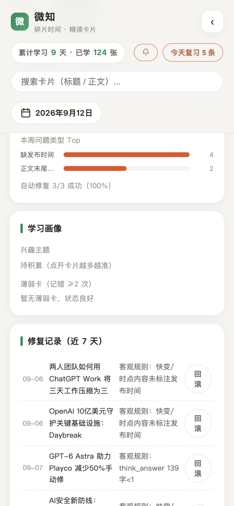

### 时效窗口按内容寿命分，不是一个数字

原来 8 个源共用一个 7 天窗口。结果是把「20 天前的深度长文」和「20 天前的快讯」当成一回事：长文过了七天就读不到了，而快讯其实过期更快。

现在按内容寿命分档：官方公告、论文、媒体这类 7 天，博客和分析通讯 30 天，单个源还能在配置里覆盖。

配置从「一个数字」变成「一张表」，麻烦了一点。改动那天，一篇 8 月 24 日的文章（19 天前）按 30 天窗口产出了卡片；旧规则会直接把它拦掉。

### 「见过」和「产过」是两件事

抓取的时候，程序会给所有新条目写上「已见过」的指纹，但后面只有几篇真会被挑中产卡。剩下的永久变成已见过，再也不会被考虑。

表现很怪：某个源 feed 中段一批四个月前的条目从来没被处理过，而比它新的和比它旧的却都算见过。

现在指纹只在一条有结论时才写——要么被挑中处理过，要么已经超出时效窗口。没被挑中但还在窗口内的，留在池子里等下一轮。代价是多存一点、多算一点（指纹库从 300 条放到 3000 条）。

下面这张图是当天两次运行的真实对照：老规则会让 145 条永久消失，新规则留下 19 条。

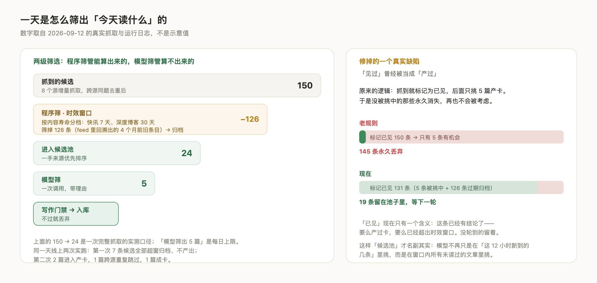

## 它真的在跑

不是能跑起来的 demo，是每天在生产的实例。下面是 2026-09-12 的数据。

| | |
|---|---|
| 首张卡 | 2026-08-19 |
| 累计卡片 | 516 张（前沿 180、计划 131、词汇 43、数学 36、精读 35、论文 30、原理 23、技能 10） |
| 有产出的天数 | 25 天 |
| 抓取源 | 8 个 |
| 抽出的证据 | 1659 条，来自 12 个来源 |
| 自动化测试 | 578 个，不调用任何模型 API |
| 部署 | 一台 2C2G 香港轻量服务器，SQLite 单文件，没有外部依赖 |

模型调用从 9-11 开始记审计：75 次调用，输入 19.4 万 token，输出 4.2 万 token，平均延迟 3.6 秒。按 DeepSeek 现在的价目表折算大约每天两毛钱。这个数字只覆盖走统一 provider 接口的调用，巡检和管家那部分还没接进来，所以是折算值，不是账单。

## 系统结构

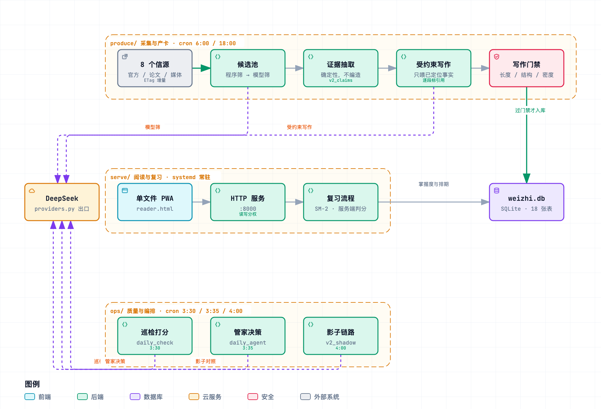

图的源文件是 [architecture.spec.json](docs/assets/readme/architecture.spec.json)：改了架构就改它重渲，别手改图片——手画的图会静默过期。

想看**可交互版**（切明暗主题、按「产卡链路 / 读到与记住 / 凌晨自己跑的」三条路径追踪，能缩放）：

**[打开可交互版 →](https://andy021110.github.io/weizhi/)**

目录也按这四层分，代码和数据是分开的：

```
weizhi/
├── weizhi/                    # 运行时包，按职责分四层
│   ├── core/                  #   基础设施：数据层、模型出口、结构校验、路径
│   ├── produce/               #   采集与产卡：抓取、筛选、证据抽取、写作、配图
│   ├── serve/                 #   阅读与复习：HTTP 服务、复习流程、掌握度、计划
│   │   └── web/               #   前端资源（单文件 PWA）
│   └── ops/                   #   质量与编排：巡检、管家、修订候选、影子链路
├── tools/                     # 开发与一次性脚本
├── deploy/                    # 部署脚本、systemd 单元、nginx 配置
├── docs/                      # 21 篇产品与设计文档 + 索引
│   └── assets/readme/         # 本 README 用到的图
└── tests/                     # 578 个测试
```

`config.json`（含密钥）、`weizhi.db`、`quality_reports/`、`backups/` 都是运行期数据，留在部署根目录，不进仓库。代码里用 `weizhi/core/paths.py` 区分数据目录和前端资源目录，所以整理代码不需要动数据。

数据模型和更细的设计决策在 [ARCHITECTURE.md](ARCHITECTURE.md)（[English](ARCHITECTURE.en.md)）。

### 定时任务

| 时间 | 任务 | 做什么 |
|---|---|---|
| 6:00 / 18:00 | `python -m weizhi.produce.pipeline` | 抓 8 个源，建候选池，两级筛选，产卡 |
| 3:30 | `python -m weizhi.ops.daily_check` | 质量巡检打分，生成修订候选 |
| 3:35 | `python -m weizhi.ops.daily_agent` | 管家决策，发通知（荐读、待拍板、周报） |
| 4:00 | `python -m weizhi.ops.v2_shadow` | 影子链路，用来对比新流程的产出 |

## 工程上能核对的部分

578 个测试，覆盖事实抽取、写作门禁、筛选降级、SM-2、SimHash 去重、接口密封（答案不下发到浏览器）、只读权限边界。用临时 SQLite 库隔离，不碰真实数据。

每次模型调用都记 provider、模型、prompt 版本、输入指纹、耗时、重试和错误，输入指纹同时也是幂等缓存键。

`docs/` 下有 21 篇产品与设计文档（外加一份[索引](docs/README.md)），其中 [范围决策](docs/范围决策-保留降级合并删除.md) 专门记录我主动砍掉了什么，[部署守则](docs/部署守则-仓库与线上同步.md) 记录仓库和线上怎么保持同步。

主人口令和只读演示口令是分开的，演示角色在服务端被拒绝一切写操作。

## 已知不足

- **产品自己的成功标准还没有埋点。** 我能证明卡片被读了，证明不了读完判断变了。这是最该补的一块；没有它，现在所有的质量指标衡量的都是产出，不是效果。
- **调用审计覆盖不全**，所以成本是折算值（见上）。
- **候选池小的时候，推荐排序会挤掉深度源。** 现在是先按来源级别排再截断，某天快讯类内容填满上限，博客类就被系统性切掉。知道，还没修。
- **按单用户设计。** 没有多租户和账号体系，给别人看只有一个只读口令。
- **前端是单文件原生 JS**，没有构建和组件化，靠渲染测试和自觉兜着。

## 本地跑起来

```bash
python3 -m venv .venv && source .venv/bin/activate
pip install -r requirements.txt

cp config.example.json config.json    # 填 DeepSeek API key、access_token、demo_token
python -m weizhi.serve.reader         # 打开 http://localhost:8000/?key=<你的口令>

python -m weizhi.produce.pipeline --limit 2      # 手动抓一轮并产卡
python -m weizhi.produce.pipeline --fetch-only   # 只看候选池，不产卡、不写指纹
python -m weizhi.ops.daily_check --dry-run --limit 3   # 预览质量巡检
python -m weizhi.ops.daily_agent --dry-run       # 预览管家决策
```

跑测试：

```bash
pip install -r requirements-dev.txt
python -m pytest tests/ -q     # 578 个，约 45 秒，不调用任何模型 API
```

`tools/` 下的脚本用 `python -m tools.<名字>` 运行（目录里的脚本依赖仓库根在 `sys.path` 上）。

## 安全

`config.json`（API key 和口令）已被 `.gitignore` 排除，它的备份 `config.json.bak*` 也排除了，仓库里只有 `config.example.json` 模板。

服务只监听 `127.0.0.1`，由 nginx 反代，真实来访 IP 通过 `X-Forwarded-For` 传进来。nginx 不给静态文件开直连目录——那样「文件在哪」会有两个来源，整理代码目录时容易静默 404。

只读演示口令可以公开，主人口令不要外传。换口令是改 `config.json` 然后重启服务。

## License

MIT
